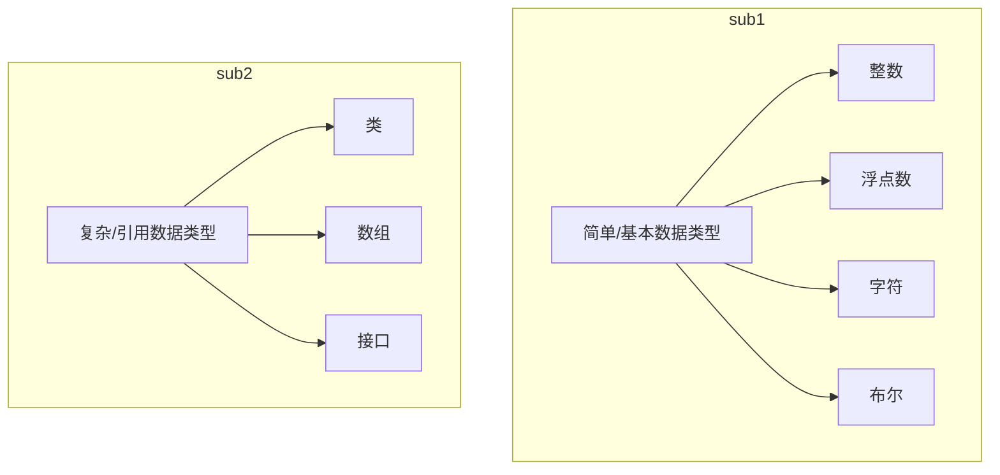
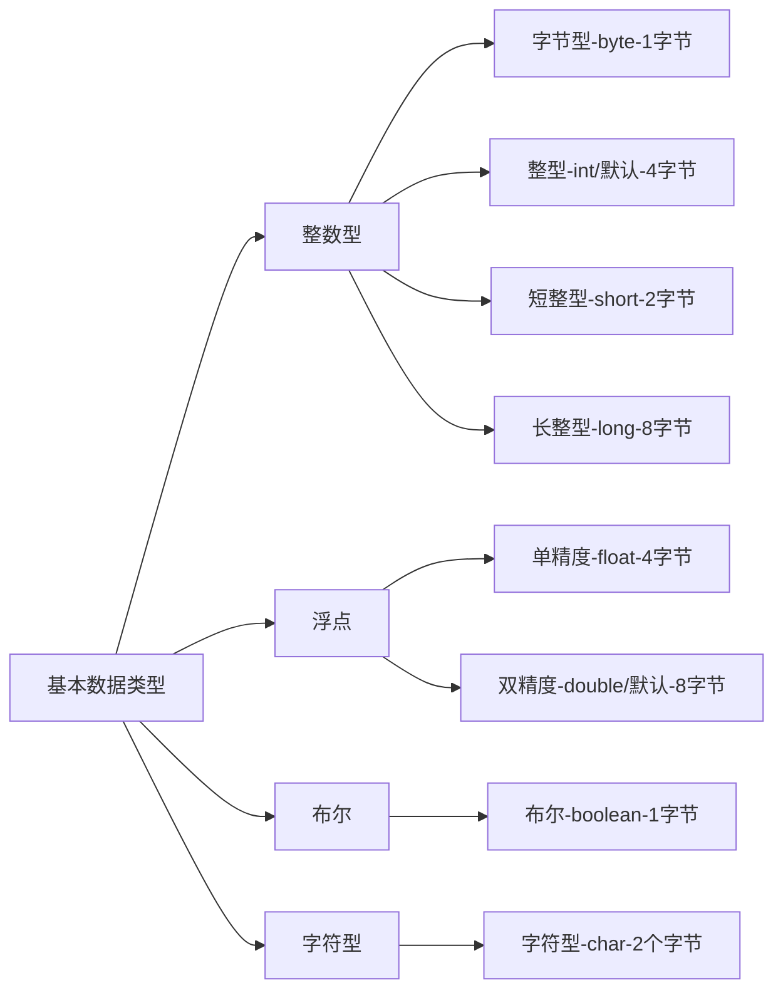

[toc]

## 5.2 数据类型

### 5.2.1 数据类型分类

#### a) Java 的数据类型分为两个**大致分类**：

##### 基本/简单数据类型

##### 复杂/引用数据类型



#### b) 基本数据类型的**详细分类**： 四类八种



| 数据类型     | 关键字    | 内存占用 | 取值范围              |
| ------------ | --------- | -------- | --------------------- |
| 字节型       | byte      | 1字节    | -128-127              |
| 短整型       | short     | 2字节    | -32768~32767          |
| 整型         | int(默认) | 4字节    | -2^31~2~31-1          |
| 长整型       | long      | 8字节    | -2^63~2^63-1          |
| 单精度浮点数 | float     | 4字节    | 1.4013E-45~3.4028E+38 |
| 双精度浮点数 | double    | 8字节    | 4.9E-324~1.7977E+308  |
| 字符型       | char      | 2字节    | 0~65535               |
| 布尔类型     | boolean   | 1字节    | true\false            |


#### c) 常用的数据类型说明

**基本数据类型**
整数型、浮点型、字符型、布尔型

<details open>
<summary>更多详细描述</summary>
<p>
浮点型，单精度和双精度，由于长度不同，所表示的数字精确度也是不同的，双精度值精确度高于单精度，这里的“精确”指的是什么意思呢？数学中的小数点保留位数越多即越精确。 值得注意的是，在程序中，不论是单精度还是双精度这些浮点数，都是一个近似值，并不是一个精确值。
</p>
<p>
为什么计算机无法表示精确数字？
在人类生活中，我们常用十进制，10/3 是一个无限循环小数，在计算机中，即便是二进制，同样也没有办法去保存一个无限循环小数，因为不可能存在无限内存去存储。
这里老师讲的非常好，如果有迷惑的地方，回看一下（从来没有遇到能把这个精度讲得这么通俗清晰的）
</p>
<p>
这里是一点点深入：
</p>
<table>
<tr>
<th>类型</th>
<th>内存占用 (字节)</th>
<th>能表示的最取值范围</th>
<th>能表示的最大数位</th>
</tr>
<tr>
<td>长整型long</td>
<td>8</td>
<td>2^63-1</td>
<td>18</td>
</tr>
<tr>
<td>单精度float</td>
<td>4</td>
<td>3.4028E+38</td>
<td>小数点后38位</td>
</tr>
<tr>
<td>双精度double</td>
<td>8</td>
<td>1.7977E+308</td>
<td>小数点后308位</td>
</tr>
</table>
<p>
表中，long整型占用内存8个字节，最多能够表示18位数，但是占据内存4个字节的float单精度类型，能表示数的范围却更大，这是因为浮点类型能够采用科学计数法，而整型则不能。  这也否定了占用内存大就一定能表示更大的值范围的这种错误认知。
</p>
</details>
**引用数据类型（今后学习）**
字符串、数组、类、接口、Lambda


#### d) 关于数据类型的注意事项

1. 数据类型的种类很多，但是我们所说的字符串，Java中并不是基本数据类型，而是引用数据类型String;

   > 只要不属于四类八种的基本数据类型，就一定是引用数据类型。 

2. 浮点型**可能**只是一个近似值，并非精确的值。 

   > 像 3.3333 就是一个精确类型， 但是 10/3 就没办法精确表示；

3. 数据类型能够表示的数值范围，不一定和内存占用正相关。 

   > 例如，float数据类型范围比long更加广泛，但是float占据4个字节，而long占据8字节

4. 浮点数当中，在Java中，默认类型是double类型。如果一定要使用float累心，需要加上一个后缀  `F/f`

   如果是整数，则默认为int类型，如果一定要使用long类型，需要加上后缀`L/l `

   > 例如，不过不加指定， `3.14` 在 Java中，就是一个double双精度浮点数，想要用float单精度表示，就是 `3.14F` 或者 `3.14f` ；
   >
   > 同样的`System.out.println(100)` 这里的 `100` 就是一个int类型。 想要以long类型输出，就要加上后缀 `System.out.println(100L)`


## 5.3 数据类型转换

Java 程序中，要求参与计算的数据类型，必须保证数据类型的一致性，如果数据类型不一致的时候，就会发生类型的转换。 

### 5.3.1 自动数据类型转换（隐式类型转换）

当不同的数据类型在计算的时候，会优先将“**取值范围小的数据类型**” 自动提升为“**取值范围大的数据类型**”。

**自动类型转换：**

1. 特点：代码不需要进行特殊处理，自动完成；
2. 规则：数据范围从小到大；


```java
public class MyApplication {
    public static void main (String[] args){
        byte a = 1;
        int b = 2;
        System.out.println(getType(a+b));//class java.lang.Integer
        
    double c = 2.3513;
    float d = 5.3431F;
    System.out.println(getType(c+d));//class java.lang.Double
    }
    private static String getType(Object a) {
        return a.getClass().toString();
    }
}
```

> 以上这个示例中，程序为了能够保证正常计算执行， 在计算 `a + b` 时，由于 a,b 数据类型不同， Java在执行时，会将取值范围小（-128~127）的 byte b 自动转换为和 取值范围大（-2^31~2~31-1）的int a 的 int类型。  计算的输出，也将会是int类型。 

### 5.3.2 强制类型转换（显示类型转换）

**强制类型转换：**

1. 特点：代码需要进行的格式处理，不能自动完成；

2. 格式： `范围小的类型 范围小的变量名 = （范围小的类型） 原本范围大的数据`

   ```java
   int num1 = (int) 100L
   ```

   > 变量num1的声明类型是int, 但是其所赋的值实则为 100L 是一个Float 类型
   >
   > （float 取值范围  > int 取值范围）
   >
   > 这时候，按照指定格式，就能将100L 转换为 int 类型了。 


## 5.4 数据溢出以及在数据类型转换的时候需要注意的事项

在以上案例中：

```java
public class MyApplication {
    public static void main (String[] args) {
        int num1 = (int) 100L;
    }
}
```

将右边的值强制转换为左边声明的类型时，如果右边的值本来就可以用左边的声明类型有相应的转换值，是没有问题的。 

> 上例中，即 100L 这个浮点数原本就在int的表示范围之内，这样是不会有任何问题的。

但是，如果右边的值超出了能够转换的类型所能表示的最大取值范围。 就可能发生数据溢出：

```java
int num = (int) 6000000000L;
System.out.println(num);//不报错但是结果是1705032704
```

> 通俗的说明：int类型所能表示的最大值大概是21个亿，将一个60个亿的float类型，强制转换成int, 语法没有问题，不报错，但是 int 这个 “容器” 装不下 60个亿这个值，因此“洒了”，也就是溢出。 

不仅仅可能会发生数据溢出，还可能会发生精度损失：

```java
int num = (int) 3.5;
System.out.println(num);//不报错，但是结果输出3
```

将一个浮点数转换成一个int，小数部分无法表示， 所有的小数位都会被舍弃掉。（注意：并不是四舍五入，而是只保留整数）

**在强制转换的时候注意事项：**

1. 强制类型转换一般不推荐使用，因为有可能发生精度损失、数据溢出。

2. byte/short/char 这三种类型都可以发生数学运算，例如加法 “+”。

   ```java
   char zifu = 'A';
   Sytem.out.println(zifu + 1);//66
   ```

3. byte/short/char 这三种类型在运算的时候，都会被首先提升为int类型，然后再计算。

   ```java
   byte num4 = 40;
   byte num5 = 50;
   byte result1 = num4 + num5;
   System.out.println(result1);//java: 不兼容的类型: 从int转换到byte可能会有损失
   ```

   > 分析：为什么会出现这个报错？
   >
   > 1. byte 类型在进行运算的时候，会发生数学运算；
   > 2. byte 类型在运算的时候，会被首先提升为int 类型。
   >
   > 所以 num4 + num5 在执行的时候，相当于先被转换成了int, 变成了两个int值在做加法运算，但是在接受的时候，声明的变量类型却是 byte, 
   >
   > 把两个int值的加法运算结果（还是int） 赋值给一个 byte 容器，而int类型的取值表示范围是大于byte的，所以会报错“可能会有损失”，因为可能“装不下”。

4. boolean 类型不能发生任何数据类型转换

   > 注意这不同于JavaScript，true,false 不能转换成 1，0。


计算中，一切的数据都是二进制的，字符'A'的
